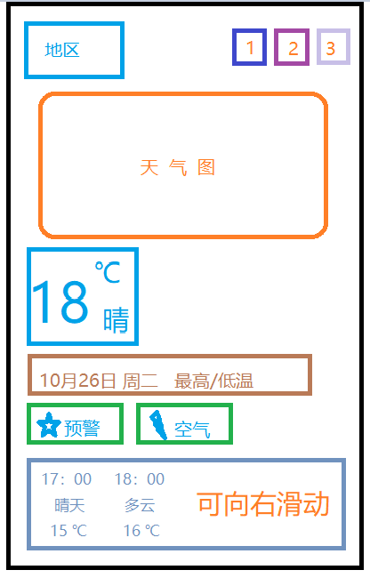
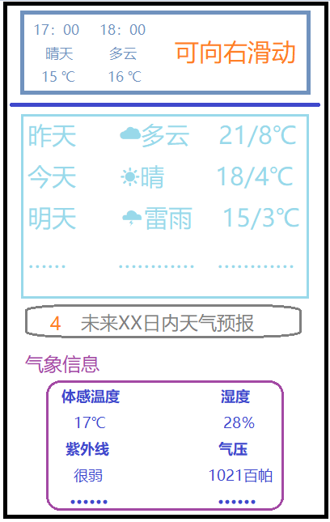
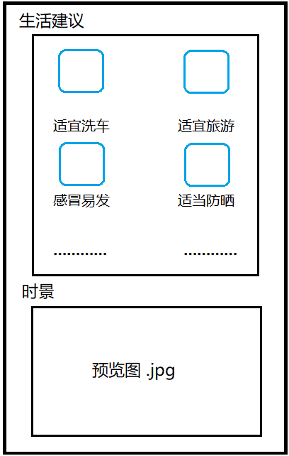
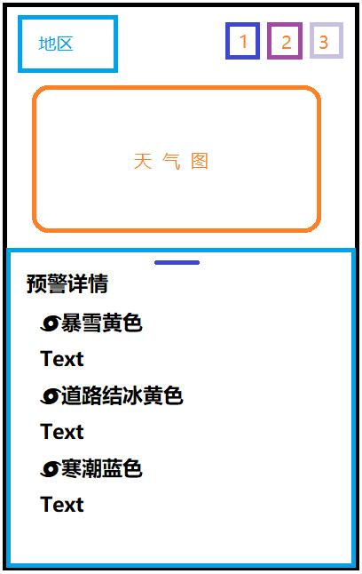
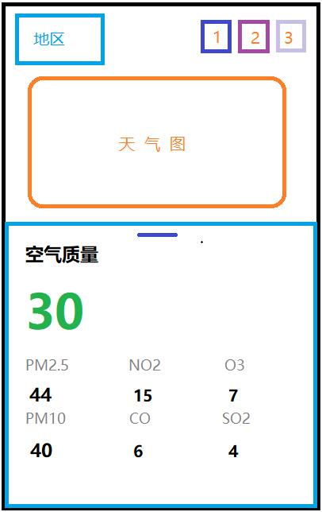
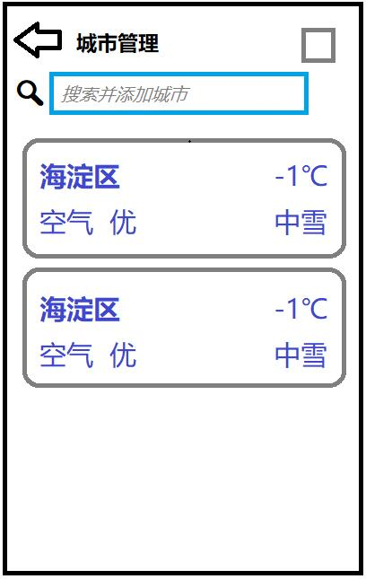

# SunnyWeatherIos
## SunnyWeatherIos软件需求和界面设计相关

+ 主界面（上）

  + 取消开屏插画，所见即所得。

  + 地区定位功能，每当您处在不同的城市时，左上角都会切换到不同城市的天气预报信息的显示，出行无忧；也可以通过右上角的城市管理功能（2）添加并查看大部分地区的天气信息，足不出户看世界。

  + 天气预报图像功能：将天气信息详略得当地分布在主界面中，不同的天气情况具有不同的图像显示以及文字描述（尽量以图片展示），更加清晰直观地获取天气信息，拒绝臃肿化。

  + 按时间段显示天气，可通过向右滑动来浏览至多未来24小时内的每个时间点的天气温度、下雨的概率、湿度等。

  + 将预警信息、空气质量以按钮的形式排布在日期下，仅显示缩略内容。可通过点击按钮以弹出浮动窗口，窗口中将展示更加具体的信息。

  + 拓展控件以小图标排列在右上角，如疫情动态、城市管理、设置等内容，小而精。

+ 主界面（中）

  + 至多显示该地区内未来五天的天气预报信息，包括天气状况、每日最低/最高温度等，您可以通过app计划进行户外活动或受天气影响的其他生产和生活活动。

  + 显示每天日出和日落的具体时间，让每个人都能领略最朦胧的晨曦和最迷幻的夕阳，或是安排出行等。

  + 集中展示6-8项关于日常天气的基本信息，如体感温度，湿度，气压，紫外线强度，能见度，风向及风速和其他天气信息。

+ 主界面（下）

  + 生活与健康信息板块，主要是展示一些日常不同的天气预防和健康小贴士，如服装穿搭建议，紫外线户外活动建议。此板块会预留2-4组动态tips，根据每日的天气状况提供针对性建议内容，此外还会预设4组以上固定建议并随机展示。

  + 时景展示板块，为用户提供个性化时景相册，可供用户上传并下载更多时景美图。

+ 气象预警界面

  + 采用弹出式卡片设计，依赖彩云天气API实时获取天气预警信息。并将所有预警信息排列展示在卡片内，帮助用户及时防范气象灾害，安排出行工作等。

  + 严格依照全国灾害预警规定统一标准，种类上主要分为台风、暴雨、冰雹、大雾、道路结冰、高温、寒冷、灰霾、雷雨大风和森林火险等16类，等级上分别用蓝色、黄色、橙色和红色代表一般、较重、严重和特别严重4个等级，此外还会展示发布单位及应对措施。

+ 空气质量界面

  + 采用弹出式卡片设计，依赖彩云天气API实时获取空气质量信息。主要展示PM2.5、NO2、O3、PM10、CO、SO2的浓度，帮助用户随时改善自身所处环境的健康状况。

  + | 缺数据 missing   | 优 good | 良 satisfactory | 轻度污染 moderate | 中度污染 unhealthy | 重度污染 very poor | 严重污染 hazardous |
    | ---------------- | ------- | --------------- | ----------------- | ------------------ | ------------------ | ------------------ |
    | 无测站国家和位置 | 0~50    | 51~100          | 101~150           | 151~200            | 201~300            | >300               |

    根据我国目前采用的空气污染指数对当日空气质量分级评分以表征空气质量状况与空气污染的程度，并且表示城市的短期空气质量状况和变化趋势，帮助易感人群规划户外活动时间的同时也警示健康人群注意防范。

+ 城市管理界面

  + 

## 软件更新日志

### V1.0

+ 完成天气详情页面并实现网络功能，即通过彩云API和高德地图API获取天气、地理信息。

### V1.1

+ 完成城市管理页面并实现删除、移动已有城市顺序功能。
+ 实现根据输入地名查找地理位置并添加至天气列表功能。
+ 管理页面和详情页面背景会随之天气不同而改变。

### V1.2

+ 完成空气质量和预警信息按钮相关功能。
+ 现在可以定位手机位置并获取当前位置天气信息。
+ 实现了下拉刷新功能。
+ 修复了一个数组越界引起的闪退问题。

### V1.3

+ 完成了设置页面和相关功能。
+ 实现持久化功能，能够在关机和退出应用后保存相应数据。
+ 优化大量UI细节，增加更多信息的可视化。

### V1.4

+ 优化切换温度单位后的显示效果，现在在选择华氏单位的情况下不会出现先显示摄氏温度后在显示华氏摄氏度的闪屏现象。
+ 更换搜索地理位置API，更加完善的中文全拼搜索，更准确、更多样的搜索结果，同时优化了搜索结果显示UI。
+ 修复状态栏搜索框取消按钮文字英文的问题。

### 已知问题

+ 点击删除按钮后会返回主页面。
+ 列表删除按钮文字为英文。
+ Navigationbar概率性丢失模糊和上滑效果。

  

